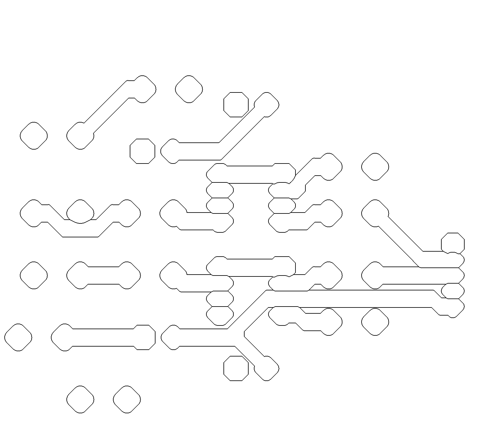

# programas
## PCB to CNC optimizer: python3 islas.py [filename.png] [thickness]
This program prepares a PCB image to make tracks thicker for CNC machining.

Python Libraries needed:

- PyopeCL (you may use POCL)
- OpenCV

    
    

Current measurement for ARDUINO using a low side resistance.
code: currentMeasu.ino

